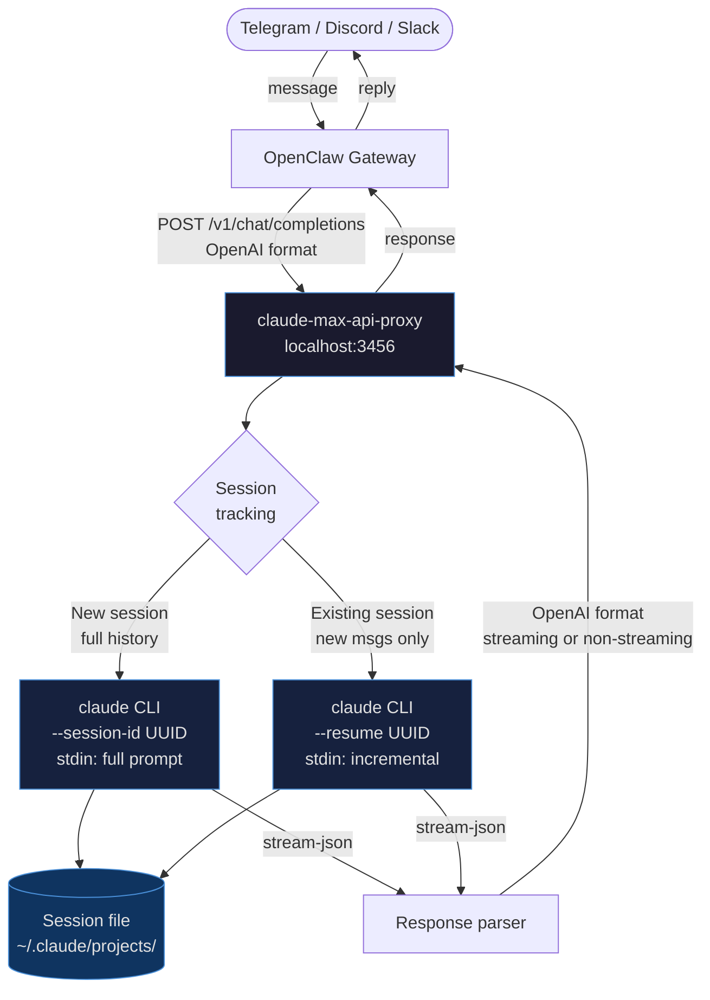
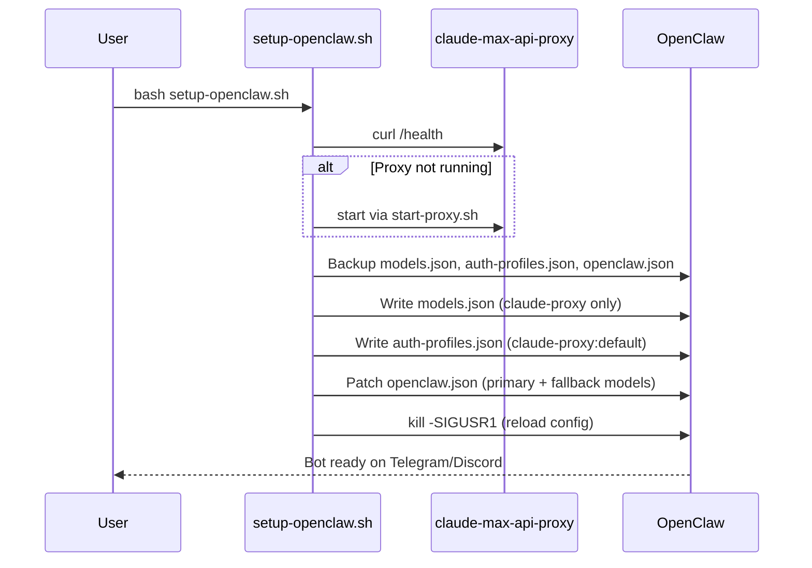

# claude-max-api-proxy

> OpenAI-compatible API server that wraps **Claude Code CLI** — use your Claude Max subscription with any OpenAI-compatible client (OpenClaw, Cursor, Continue, etc.) **for free**.

Originally forked from [atalovesyou/claude-max-api-proxy](https://github.com/atalovesyou/claude-max-api-proxy) — significantly improved for production use.

## How It Works



## Architecture

```mermaid
flowchart LR
    subgraph proxy["claude-max-api-proxy (Express)"]
        R[Routes\n/v1/chat/completions] --> SM[Session Manager\ntrack msg counts]
        SM -->|INIT: full history| AD1[messagesToPrompt]
        SM -->|INCR: new msgs only| AD2[extractIncrementalPrompt]
        AD1 --> SP[Subprocess Manager\nstdin + stream-json parser]
        AD2 --> SP
    end

    subgraph cli["Claude Code CLI"]
        SP -->|--session-id UUID\nnew session| S1[claude --print]
        SP -->|--resume UUID\nexisting session| S2[claude --print]
    end

    subgraph api["API Endpoints"]
        E1["POST /v1/chat/completions"]
        E2["GET  /v1/models"]
        E3["GET  /health"]
        E4["GET  /v1/sessions"]
        E5["DELETE /v1/sessions"]
        E6["DELETE /v1/sessions/:id"]
    end

    api --> R

    style proxy fill:#1a1a2e,color:#e0e0e0,stroke:#4a90d9
    style cli fill:#16213e,color:#e0e0e0,stroke:#4a90d9
    style api fill:#0f3460,color:#e0e0e0,stroke:#4a90d9
```



---

## Features (v2.0)

| Feature | v1.0 (original) | v2.0 (this fork) |
|---------|-----------------|------------------|
| Session context | Full history every request | **Incremental** — only new messages |
| Large contexts | Crash (`E2BIG`) | **Stdin-based** — no size limit |
| Tool use | ❌ | ✅ Bash, Read, Write, Edit, Glob, Grep, WebSearch, WebFetch |
| Timeout | 5 minutes | **15 minutes** |
| Session API | ❌ | ✅ `GET/DELETE /v1/sessions` |
| Session ID | manual | **Auto-derived** (header → user → hash) |
| Content format | string only | **string + array** (`[{type,text}]`) |
| Resume flag | `--session-id` always | ✅ `--session-id` (new) / `--resume` (existing) |
| Model support | basic | ✅ Versioned + family aliases + GPT drop-in aliases |
| System prompt | inline XML | ✅ Native `--system-prompt` flag |
| Concurrency | unlimited | ✅ Semaphore (default: 4), 429 when full |
| Stats endpoint | ❌ | ✅ `GET /stats` (tokens, latency, requests) |
| Image support | ❌ | ✅ base64 + URL image blocks |

---

## Requirements

- Node.js ≥ 20
- [Claude Code CLI](https://github.com/anthropics/claude-code) installed & authenticated
- Claude Max subscription

---

## Installation

```bash
git clone https://github.com/anggipradana/claude-max-api-proxy
cd claude-max-api-proxy
npm install
```

---

## Quick Start

### 1. Start the proxy

```bash
# Must NOT be run inside an active Claude Code session (CLAUDECODE env var)
bash start-proxy.sh
```

Or with custom port:
```bash
PORT=3456 bash start-proxy.sh
```

Verify:
```bash
curl http://localhost:3456/health
# {"status":"ok","provider":"claude-code-cli","sessions":0}
```

### 2. Test a request

```bash
curl -X POST http://localhost:3456/v1/chat/completions \
  -H "Content-Type: application/json" \
  -H "X-Session-Id: my-chat" \
  -d '{
    "model": "claude-sonnet-4",
    "stream": false,
    "messages": [{"role": "user", "content": "Hello!"}]
  }'
```

### 3. (Optional) Configure OpenClaw automatically

```bash
bash setup-openclaw.sh
```

> See [OpenClaw Setup](#openclaw-setup) below for details.

---

## OpenClaw Setup



### Manual Setup

If you prefer to configure OpenClaw manually, edit these 3 files:

**`~/.openclaw/agents/main/agent/models.json`**
```json
{
  "providers": {
    "claude-proxy": {
      "baseUrl": "http://127.0.0.1:3456/v1",
      "api": "openai-completions",
      "apiKey": "dummy",
      "models": [
        {
          "id": "claude-sonnet-4",
          "name": "Claude Sonnet 4 (via Max Proxy)",
          "reasoning": true,
          "input": ["text", "image"],
          "cost": {"input": 0, "output": 0, "cacheRead": 0, "cacheWrite": 0},
          "contextWindow": 200000,
          "maxTokens": 32000
        },
        {
          "id": "claude-haiku-4",
          "name": "Claude Haiku 4 (via Max Proxy)",
          "reasoning": false,
          "input": ["text", "image"],
          "cost": {"input": 0, "output": 0, "cacheRead": 0, "cacheWrite": 0},
          "contextWindow": 200000,
          "maxTokens": 32000
        }
      ]
    }
  }
}
```

**`~/.openclaw/agents/main/agent/auth-profiles.json`**
```json
{
  "version": 1,
  "profiles": {
    "claude-proxy:default": {
      "type": "api_key",
      "provider": "claude-proxy",
      "key": "dummy"
    }
  },
  "lastGood": { "claude-proxy": "claude-proxy:default" }
}
```

**`~/.openclaw/openclaw.json`** (patch `agents.defaults.model`):
```json
{
  "agents": {
    "defaults": {
      "model": {
        "primary": "claude-proxy/claude-sonnet-4",
        "fallbacks": ["claude-proxy/claude-haiku-4"]
      },
      "models": {
        "claude-proxy/claude-sonnet-4": {},
        "claude-proxy/claude-haiku-4": {}
      }
    }
  }
}
```

Then reload the gateway:
```bash
kill -SIGUSR1 $(pgrep -f openclaw-gateway)
```

---

## API Reference

### `POST /v1/chat/completions`

Standard OpenAI format. Supports streaming (`"stream": true`) and non-streaming.

**Session pinning** (optional):
```bash
# Via header (recommended)
-H "X-Session-Id: my-conversation"

# Via user field
-d '{"user": "my-conversation", ...}'
```

If no session ID is provided, one is derived from a hash of the first user message.

### `GET /v1/models`

Returns all supported model IDs including versioned, family aliases, and GPT aliases.

### `GET /stats`

```json
{
  "uptime": { "ms": 60000, "human": "1m 0s" },
  "requests": { "total": 10, "completed": 9, "errors": 1, "active": 0, "queued": 0 },
  "concurrency": { "limit": 4, "active": 0 },
  "sessions": { "total": 3 },
  "tokens": { "totalInput": 1500, "totalOutput": 800, "total": 2300 },
  "performance": { "avgResponseMs": 4200, "sampledRequests": 9 }
}
```

### `GET /health`

```json
{
  "status": "ok",
  "provider": "claude-code-cli",
  "sessions": 3,
  "activeSubprocesses": 0,
  "concurrencyLimit": 4,
  "queuedRequests": 0,
  "timestamp": "2026-02-25T05:00:00.000Z"
}
```

### `GET /v1/sessions`

```json
{
  "sessions": [
    {
      "externalId": "hdr_my-chat",
      "claudeSessionId": "550e8400-e29b-41d4-a716-446655440000",
      "model": "sonnet",
      "messageCount": 6,
      "createdAt": "2026-02-25T03:00:00.000Z",
      "lastUsedAt": "2026-02-25T03:05:00.000Z"
    }
  ],
  "total": 1
}
```

### `DELETE /v1/sessions`
Reset all sessions (next request will re-initialize from full history).

### `DELETE /v1/sessions/:id`
Reset a specific session by its `externalId`.

---

## Models

### Versioned IDs (recommended for production)

| Model ID | Description |
|----------|-------------|
| `claude-sonnet-4-6` | Claude Sonnet 4.6 — latest sonnet |
| `claude-sonnet-4-5` | Claude Sonnet 4.5 |
| `claude-haiku-4-5` | Claude Haiku 4.5 — latest haiku |
| `claude-opus-4-5` | Claude Opus 4.5 |

### Family aliases (always latest in family)

| Model ID | Description |
|----------|-------------|
| `claude-sonnet-4` | Latest Sonnet (default) |
| `claude-opus-4` | Latest Opus |
| `claude-haiku-4` | Latest Haiku |
| `sonnet` / `opus` / `haiku` | Short aliases |

### GPT drop-in aliases

| OpenAI Model | Maps to |
|--------------|---------|
| `gpt-4o` | `sonnet` |
| `gpt-4o-mini` | `haiku` |
| `gpt-4` / `gpt-4-turbo` | `opus` |
| `gpt-3.5-turbo` | `haiku` |
| `o1` / `o1-preview` | `opus` |
| `o1-mini` / `o3-mini` | `sonnet` |

Also accepted: `claude-code-cli/claude-sonnet-4` prefixed variants.

---

## ⚠️ Important Notes

### CLAUDECODE env var
Claude Code sets `CLAUDECODE` env var while running. The proxy's subprocess will refuse to spawn if this is set. Always start the proxy **outside** of a Claude Code session, or use `start-proxy.sh` which unsets it automatically.

### Session files
Sessions are stored in `~/.claude/projects/` as `.jsonl` files. They accumulate over time. Use `DELETE /v1/sessions` to clear the proxy's session index, or manually delete old `.jsonl` files.

### Tool use
The proxy enables full tool use (Bash, file ops, web search) via `--dangerously-skip-permissions`. Only run this proxy in a trusted environment.

---

## License

MIT — forked from [atalovesyou/claude-max-api-proxy](https://github.com/atalovesyou/claude-max-api-proxy)
